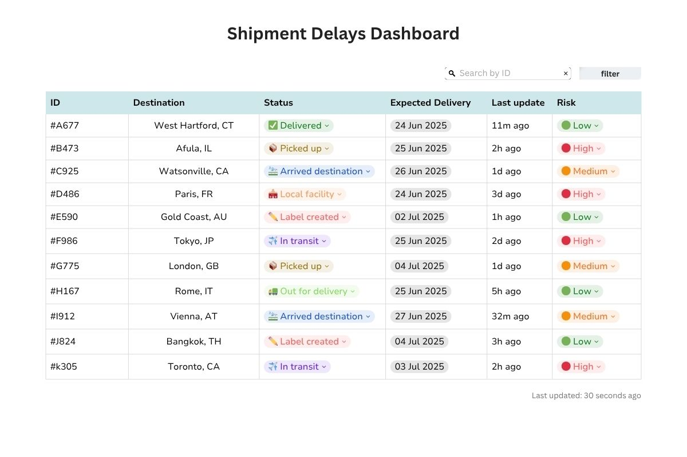

# CereBI Junior Intern Assignment

This repository contains my solution for CereBI Junior Intern Assignment.
It includes my analysis, proposed solution, UI design, sample data, API structure and code sample.

## 1. In-Depth Problem Understanding and Logical Solution Proposal

### 1.1 Analysis of Delay Factors
In large-scale logistics operations like those of LogiDog, shipment delays can result from a combination of external and operational factors. Understanding these risks is highly important for designing early warning systems.

#### External (Uncontrollable) Factors
- **Weather Conditions**  
  Severe storms, snow, or fog can ground planes, block roads, or delay ships.

- **Natural Disasters**  
  Earthquakes, floods, or wildfires can impact regions unexpectedly and disrupt transit.

- **War and Political Instability**  
  Armed conflicts or emergency declarations can stop transportation.
  
- **Holidays and Elections**  
  National holidays or public events may reduce work hours or cause full operational shutdowns in certain regions.

- **Customs Delays**  
  Shipments can be held due to inspections, missing paperwork, or customs backlog.

- **Traffic Congestion & Accidents**  
  Heavy traffic in urban areas or roadway accidents can delay trucks and couriers.

- **Strikes**  
  Labor strikes at ports, warehouses, or among drivers can disrupt the supply chain.

#### Internal (Operational) Factors

- **Customer Not Available at Delivery**  
  Failed delivery attempts cause wasted time, rerouting, or rescheduling.

- **Delivery Location Challenges**  
  Delivering to busy city centers can involve parking issues or unloading delays.

- **Last-Mile Delivery Expectations**  
  If the delivery expectation (meet on the street vs. door delivery) isn't clear, this can create inefficiencies.

- **Human Error**  
  Mistyped addresses, mislabeling, or lost packages due to manual or system entry mistakes.

- **Vehicle or Equipment Failures**  
  Truck breakdowns or sorting machine malfunctions can halt progress mid-route.

- **Warehouse Bottlenecks**  
  Overloaded warehouses or delays in sorting, labeling, or dispatching shipments.

- **IT/System Failures**  
  Issues in shipment tracking, data synchronization, or alerting systems can cause undetected or unmanaged delays.
  
While varied, many of these factors can be predicted or mitigated with proper data collection and monitoring.

---

### 1.2 Early Delay Identification Logic
At its core, delay detection in logistics is about answering this question:  
**Can this shipment still make it on time, given how far it has progressed?**

To answer this, I propose a rule-based logic that compares:  
- **Time remaining** until the expected delivery date
- **Current progress stage** in the shipment lifecycle
- **Last known tracking update timestamp**

#### 📌 Shipment Stage-Based Delay Rule

Each shipment moves through these stages:

1. label_created  
2. picked_up  
3. in_transit  
4. arrived_destination  
5. local_facility  
6. out_for_delivery  
7. delivered

We can define expected minimum stages based on how many days remain until delivery. For example:

| Days Until Delivery | Minimum Expected Stage |
|---|---|
| 5+ days | picked_up or later |
| 3–5 days | in_transit or arrived_destination |
| 1–2 days | local_facility |
| 0–1 days | out_for_delivery |

**Rule 1: Progress Mismatch**  
If the shipment is behind the expected stage based on time left until delivery — trigger an alert.
This rule captures shipments that are not where they should be given the approaching deadline — a strong signal of potential delay.

| Stage | Max Expected Duration |
|---|---|
| Label created | 4 hours |
| Picked up | 1 day |
| In transit | 3-6 days |
| Arrived destination | 1 day |
| Local facility | 12 hours |
| Out for delivery | 6-8 hours | 
| Delivered | |


**Rule 2: Inactivity Rule**  
If a shipment hasn’t had an update for X hours, — raise an alert.

**Rule 3: Route Validation - Preventive Check**  
This rule is designed to **prevent misrouting before it happens**.  
Instead of waiting for a shipment to physically arrive at the wrong location and only then reacting, we check whether the **next expected stop (`expectedNext`)** is actually part of the shipment’s planned route (`routePlan`).  
If it isn’t, we raise a flag early — giving us a chance to **intervene before losing precious time**.

These three rules form a simple yet effective delay detection logic. They enable proactive alerts before customers even notice a problem, allowing the operations team to take corrective action early.


#### Q1: What types of data could serve as strong indicators for accurate delay prediction?

Effective delay prediction relies on a combination of real-time shipment tracking data, contextual information, and historical performance indicators. The following data fields would be especially useful for a rule-based or predictive system:

- **Current Status / Stage**  
  This is essential to understand where the shipment is within the delivery lifecycle and whether it's progressing as expected.

- **Last Update Timestamp**  
  Helps detect shipments that may be stalled, lost, or inactive for too long.

- **Last Update Content**  
  Provides info on what the last recorded action was.

- **Expected Delivery Date**  
  Enables comparison between time remaining and actual shipment progress.

- **Current Location**  
  Useful to determine if the shipment is geographically close to its destination.

- **Delivery Country**  
  Important for mapping the route and identifying known risks (customs requirements, regional strikes, shutdowns).

- **Route Plan or Stop List**  
  Knowing the planned path allows the system to anticipate checkpoints and potential risk points (warzones, congested ports, customs).

- **Customs Clearance Status**  
  A frequent source of delays — knowing whether the package has cleared customs is key.

- **Previous Delays for the Shipment**  
  A shipment already behind schedule may be at higher risk for further issues.

Additionally, several optional fields could enhance delay prediction:

- **Weather and Holiday Calendars**  
  External disruptions like storms or national holidays could impact delivery progress in specific regions.

- **Package Dimensions**  
  Oversized or heavy shipments may require special handling or transport methods, which can affect timing.

- **Historical Route Performance**  
  Data about previous delays on the same route can help flag high-risk patterns.

---

#### Q2: Which data fields would be critical for training a Machine Learning model, and why?

Training a machine learning model to predict shipment delays would require a diverse set of features that reflect both real-time status and contextual risk.
Here are the most critical ones:


**Core Shipment Data**

- **Expected Delivery Date**  
  Provides the baseline for defining whether a shipment was late. Also enables derived features like “days remaining.”

- **Current Status**  
  Indicates where the shipment is in the logistics flow. Helpful for identifying if it’s stalled or behind schedule.

- **Last Update Timestamp**  
  Allows the model to detect gaps in activity — a common delay signal.

- **Time in Current Stage**  
  Measures how long the shipment has remained at a certain status. Exceeding normal stage duration is often a sign of delay.

- **Shipping Method (e.g., standard, express)**  
  Different service levels have different delivery expectations, faster services are typically more vulnerable to delay because their margin for error is smaller.

- **Route / Stop List**  
  Lets the model learn which combinations of stops are more prone to issues (e.g., customs-heavy or high-traffic zones).

- **Current Location**  
  Useful for estimating time remaining and detecting geographic risk (e.g., remote delivery, conflict zone).


**Optional / Enriching Features**

- **Package Dimensions / Weight**  
  May influence handling time, routing constraints, or prioritization — especially in high-traffic seasons.

- **Weather / Holiday Data**  
  External factors like storms or national holidays can significantly impact shipments. Can be joined by location and date.

- **Historical Delay Data for Route or Country**  
  Patterns from similar past shipments can improve predictions.
  

While no single field guarantees delay prediction, machine learning models are powerful because they can learn interactions between multiple weak signals. For example, delays might occur more often when an oversized package is shipped to a remote location during peak season — a pattern too complex for rule-based logic alone.

Selecting the right fields and combining them effectively is key to building a high-performing predictive model.

---

### Q3 – Alert Triggering Approach: Rule-Based vs. ML

In the short term, I would prefer using a **rule-based alerting mechanism**, but in the long run, I believe a **machine learning model** would be a more powerful solution.

#### Rule-Based Alerts – Initial Approach  
Rule-based logic is fast to implement, easy to understand, and works well for an early-stage system like LogiDog. It doesn’t require historical data and gives the operations team full visibility into why alerts are being triggered. It can cover the majority of typical delay cases with basic logic comparing progress vs. time left, stage duration, or update inactivity.

**However**, rule-based systems become increasingly hard to manage as complexity grows — especially when dealing with thousands of shipments across multiple regions, shipping methods, and exception cases.

#### Dynamic ML Analysis – Long-Term Vision  
Once enough historical data is collected, training a machine learning model becomes highly valuable. A well-trained model can learn patterns that are too subtle or complex for hard-coded rules — such as seasonal slowdowns, route-specific risks, or combinations of weak delay signals that humans might miss.

ML models can adapt to changing trends over time and provide smarter, more nuanced risk detection. They also scale better as shipment volume increases.

For an MVP or early-stage system, rule-based logic is the right choice — it's simple, reliable, and quick to deploy. But over time, as the business and data volume grow, transitioning to a dynamic ML-based approach would result in greater accuracy and operational efficiency.

## 2. User Interface (UX/UI) Design for a Primary Alerts Screen 

  
[View on Canva](https://www.canva.com/design/DAGrAgkyPjk/5CyZ-5uSV2moG9YntzIfyQ/edit?utm_content=DAGrAgkyPjk&utm_campaign=designshare&utm_medium=link2&utm_source=sharebutton)

### Real-Time Data Updates

For keeping the dashboard data reasonably up-to-date, I would use **polling** — a technique where the frontend sends a request to the backend at regular intervals (e.g., every 30 seconds) to fetch the latest shipment data.

This approach is well-suited for this system because:
- It’s **simpler to implement and debug** compared to real-time WebSockets.
- The dashboard does not require **millisecond-level updates** like a chat or trading app — small delays are acceptable.
- It avoids the **complexity and resource cost** of managing persistent socket connections, which can be expensive at scale.


### Data Structure for Display

For displaying data in the dashboard, I would use a **denormalized** data structure. Since this screen is only for displaying information, we want faster reads, and we’re not updating any data — so denormalized makes more sense.
If we were updating data, a **normalized** approach would be a better fit, because we’d want to store shared data (like statuses or locations) in one place and have it update automatically wherever it's used.

## 3. Sample Data and Integration  
### 3.1 A sample object from the dataset:

```
{
  "id": "#B473",
  "destination": {
    "city": "Afula",
    "state": "IL",
    "country": "Israel",
    "street": "HaHistadrut 10",
    "postalCode": "18345"
  },
  "status": "Picked up",
  "expectedDelivery": "2025-06-25",
  "lastUpdate": {
    "timestamp": "2025-06-24T06:30:00Z",
    "content": "Package picked up from origin facility"
  },
  "currentLocation": {
    "city": "Haifa",
    "country": "Israel",
    "coordinates": {
      "lat": 32.794,
      "lon": 34.9896
    }
  },
  "routePlan": [
    "Tel Aviv",
    "Haifa",
    "Afula"
  ],
 "expectedNext": "Afula",
  "customsStatus": "Not required",
  "riskLevel": "High",
  "createdAt": "2025-06-22T14:00:00Z",
  "assignedCarrier": "ILPost",
  "weightKg": 12.4,
  "deliveryType": "Regular"
}
```
[View the full JSON dataset](./SampleShipments.JSON)

### 3.2 API Structure

The dashboard communicates with a backend API to retrieve and manage shipment data.  
This API is designed using RESTful conventions, supporting the following key endpoints:

--- 

#### GET `/api/shipment`  
Returns a list of all shipments.  
Supports optional query parameters for filtering by `status`, `riskLevel`, `destination`, etc.

**Example:**  
`GET /api/shipments?status=In%20transit&riskLevel=High` 

**Returns:**  
An array of shipment objects (same structure as in the sample data).

---

####  GET `/api/shipment/:id`  
Returns the full details of a specific shipment by its ID.

**Example:**  
`GET /api/shipments/B473`

**Returns:**  
A single shipment object with all fields.

---

#### POST `/api/shipment`  
Creates a new shipment object, based on the sample object above.

**Returns:**  
The newly created shipment object, including its ID.

---

#### PATCH `/api/shipment/:id`  
Updates one or more fields of an existing shipment.  
Request body:
``` 
{
  "status": "Delivered",
  "riskLevel": "Low"
}
```

**Returns:**  
The updated shipment object.
